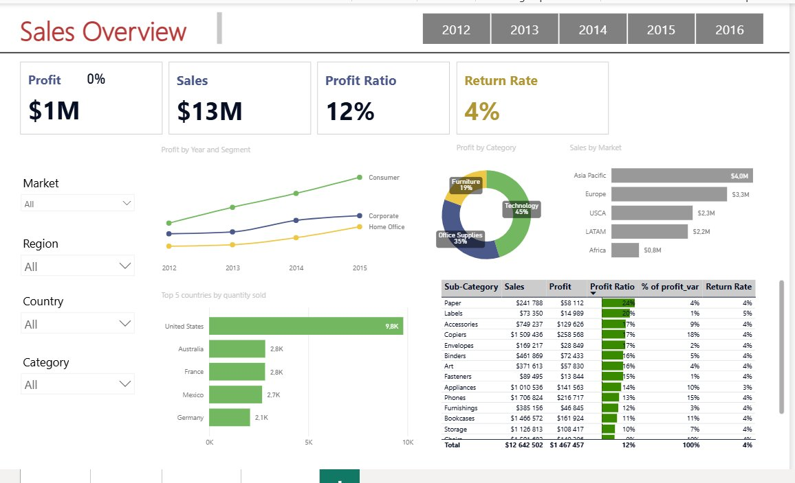
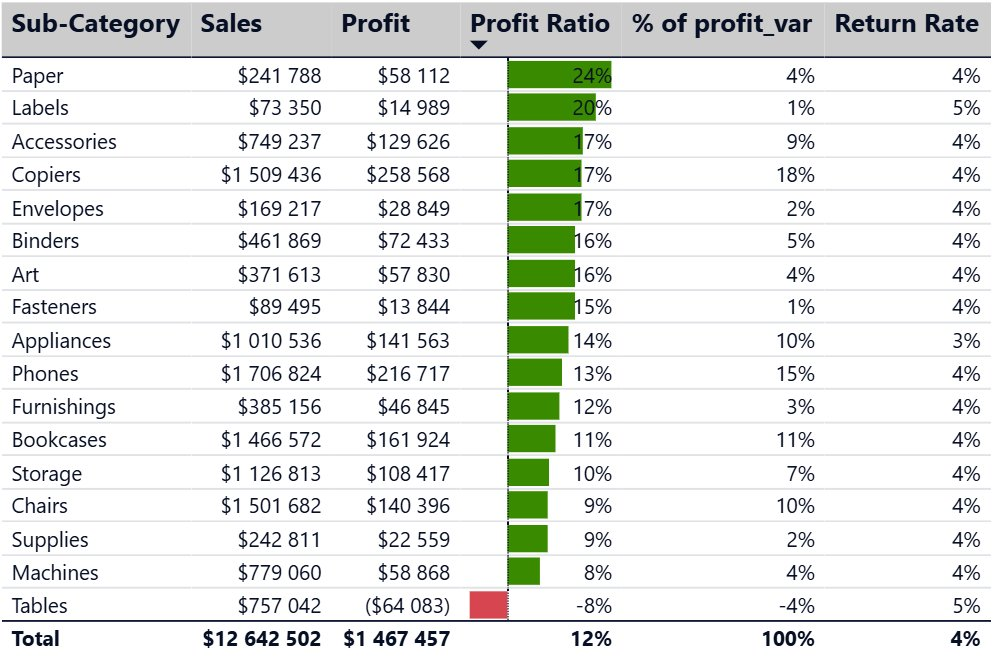
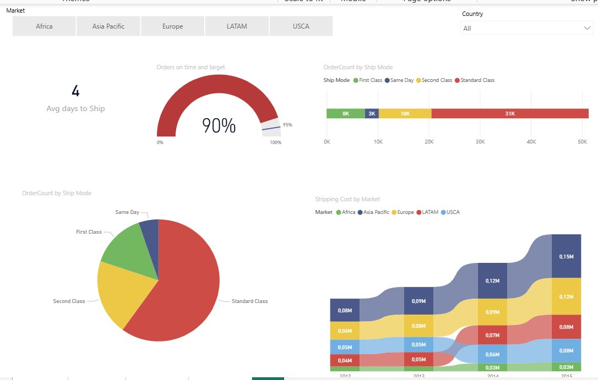
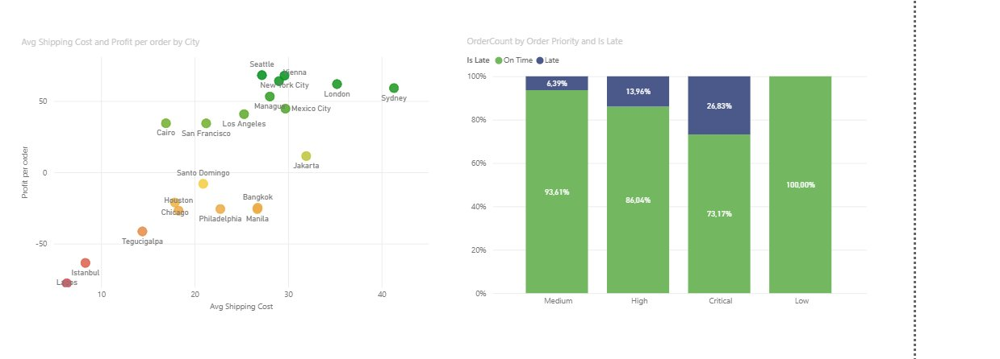

# Global Superstore. Дашборд продаж и логистики в Power BI

Интерактивный BI-отчёт по данным Global Superstore. Я собрала модель данных из исходных таблиц, написала набор DAX-мер и построила дашборд из двух страниц, который отвечает на ключевые вопросы продаж и логистики и помогает принимать управленческие решения.

## Задача

Роль BI-аналитика в компании Global Superstore. Директору по продажам нужен интерактивный отчёт, чтобы видеть выручку, прибыль, возвраты и стоимость доставки в одном месте и опираться на это в решениях.

Дашборд отвечает на вопросы вроде таких.

- Как меняется прибыль по годам и какие сегменты её тянут
- Какие категории и подкатегории прибыльны, а какие убыточны
- Какой у компании уровень возвратов
- Сколько стоит доставка и как быстро отгружаются заказы
- Где логистика работает в минус

## Данные и модель

Источник это учебный датасет Global Superstore, около 51 тысячи строк заказов.

Модель построена по схеме звезды. В центре таблица фактов Orders, вокруг справочники.

- **Orders** факты, продажи, прибыль, скидки, даты заказа и отгрузки, стоимость доставки
- **Customers** клиенты и их сегмент
- **Products** товары, категория и подкатегория
- **Cities** география, рынок, регион, страна
- **Returns** возвраты
- **Managers** менеджеры по регионам
- **Calendar** отдельная таблица дат
- **Measures (DAX)** служебная таблица только под меры

Два решения по модели, которые стоит отметить отдельно. Календарь вынесен в отдельную таблицу, без этого корректно не работают расчёты по времени. В Orders добавлен вычисляемый столбец ReturnStatus через RELATED, он подтягивает статус возврата из таблицы Returns прямо в факты.

## DAX-меры

Меры собраны в отдельной таблице, чтобы модель оставалась чистой. Ниже несколько показательных.

Доля прибыли подкатегории через ALLSELECTED. Мера реагирует на внешние слайсеры, в отличие от жёсткого ALL, и показывает вклад каждой подкатегории в выбранный срез.

```dax
% of profit_var =
VAR TotalProfit = CALCULATE([Profit], ALLSELECTED(Orders))
RETURN
DIVIDE([Profit], TotalProfit)
```

Уровень возвратов. Сначала через CALCULATE считается число возвращённых заказов, затем делится на общее число заказов.

```dax
ReturnedOrders =
CALCULATE(COUNTROWS('Orders'), 'Orders'[ReturnStatus] = "Yes")

Return rate =
DIVIDE([ReturnedOrders], [OrderCount])
```

Отдельно я разбирала более сложные конструкции на учебных мерах, которые на дашборд не вынесены. К примеру, число заказов с товаром, в названии которого есть слово Xerox. Тут нужен FILTER, потому что SEARCH нельзя положить в простой фильтр CALCULATE, и RELATED для перехода к названию товара.

```dax
Xerox orders count =
CALCULATE(
    COUNTROWS('Orders'),
    FILTER(
        Orders,
        SEARCH("Xerox", RELATED('Products'[Product Name]), 1, 0) > 0
    )
)
```

Кроме этих в модели есть базовые меры, к примеру Profit, Sales, OrderCount и Profit ratio через DIVIDE, а ещё Avg Sales NYC Profitable и средняя сумма скидки через AVERAGEX. В сумме набор покрывает агрегации, CALCULATE, FILTER, SEARCH, RELATED, AVERAGEX и управление контекстом фильтра через ALLSELECTED.

## Дашборд

### Страница Sales

KPI по выручке, прибыли, рентабельности и возвратам, динамика прибыли по сегментам, разрезы по категориям, рынкам и странам, и таблица с детализацией по подкатегориям. Слайсеры по году, рынку, региону, стране и категории.



Таблица по подкатегориям с условным форматированием. Зелёная заливка показывает уровень продаж, красным подсвечена убыточная подкатегория.



### Страница Shipping costs

Средний срок отгрузки, доля заказов вовремя, распределение по способам доставки и стоимость доставки по рынкам.



Прибыль с заказа против стоимости доставки по городам, и доля опозданий по приоритету заказа.



## Что показывают данные

**1. Рост прибыли держится на сегменте Consumer.** За 2012 по 2015 его прибыль выросла больше чем вдвое и стабильно выше остальных сегментов. Home Office всё это время остаётся самым слабым. Отсюда вопрос к бизнесу, рассматривать Home Office как точку роста или осознанно делать ставку на Consumer.

**2. Маржинальность сильно различается по подкатегориям.** Лучше всех Paper с 24 процентами и Labels с 20, хотя продажи у них небольшие. Tables единственная убыточная подкатегория, продажи 757 тысяч, но минус 64 тысячи и Profit Ratio минус 8 процентов. У крупных по обороту Phones и Chairs маржа средняя и низкая, 13 и 9 процентов. Высокий оборот сам по себе прибыль не приносит, а Tables просят пересмотреть цены или вообще убрать.

**3. Уровень возвратов низкий, 4,33 процента.** На верхнем уровне с качеством и логистикой проблем нет. Но средняя цифра может скрывать различия по категориям и регионам, поэтому следующий разумный шаг это разложить return rate по подкатегориям и рынкам и поискать слабые точки.

**4. Объём продаж и маржа не совпадают.** Phones лидер по выручке, 1,7 миллиона, при средней марже 13 процентов. Paper при скромных продажах 242 тысячи даёт самую высокую маржу 24. Для управления ассортиментом полезно помнить, что большой оборот не равно большая прибыль.

**5. Прибыль с заказа сильно зависит от города.** В верхней зоне Seattle, Vienna, New York City, London и Sydney с хорошей прибылью. Внизу Lagos, Istanbul и Tegucigalpa, там каждый заказ уходит в минус даже при невысокой стоимости доставки. Значит дело не в дорогой логистике, а в экономике заказа в этих регионах, и условия там стоит пересмотреть.

**6. Чем выше приоритет заказа, тем чаще он опаздывает.** У Critical опозданий 26,8 процента, у High 14, у Medium 6, а у Low вообще ноль. Самые срочные заказы обслуживаются хуже всего. Это явный сбой в приоритетах доставки и понятное место для улучшений.

## Инструменты

Power BI, Power Query для загрузки и подготовки данных, DAX для мер и расчётов, модель данных по схеме звезды.
